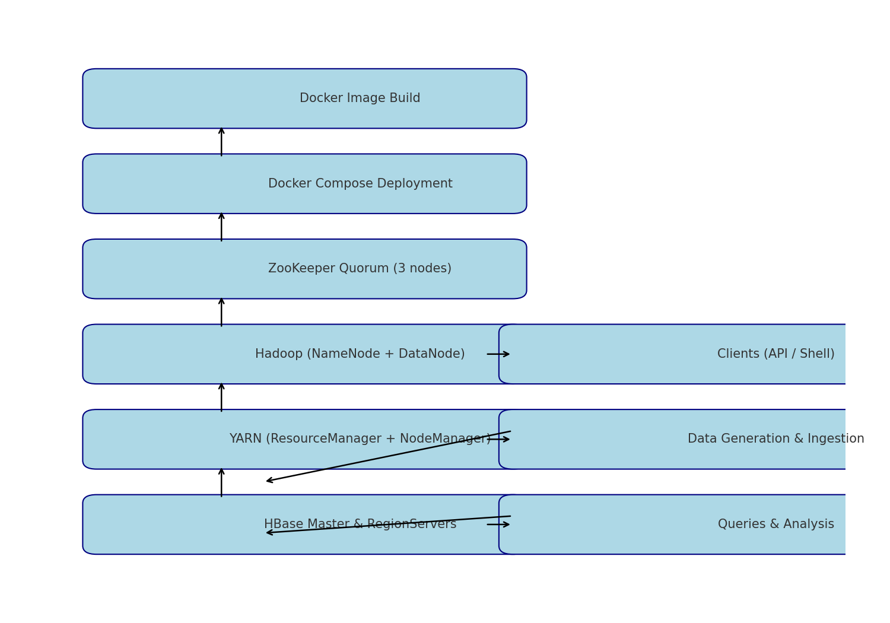

# Hadoop-HBase High Availability Project Documentation

---

## Table of Contents

- [Project Overview](#project-overview)
- [Architecture and Deployment Flow](#architecture-and-deployment-flow)
- [Data Model Design](#data-model-design)
- [Prerequisites](#prerequisites)
- [Usage Instructions](#usage-instructions)
- [Testing and Validation](#testing-and-validation)
- [Contact Information](#contact-information)

---

## Project Overview

This project demonstrates a containerized, High Availability Hadoop and HBase cluster with ZooKeeper coordination. It focuses on the **WebTable** use case, designed for storing web page content, metadata, and link relationships efficiently.

---

## Architecture and Deployment Flow

The project deployment flow consists of the following sequential steps:

1. **Build Docker Image**  
   The `Dockerfile` creates an image bundling Hadoop, HBase, ZooKeeper, configurations, and startup scripts for a standardized cluster environment.

2. **Start Cluster Using Docker Compose**  
   The `docker-compose.yaml` deploys ZooKeeper quorum, Hadoop NameNode/DataNode, ResourceManager/NodeManager, and HBase Master and RegionServers inside containers.

3. **Initialize Services with Startup Script**  
   The `start.sh` script starts ZooKeeper nodes, followed by Hadoop daemons, then HBase master and region servers to ensure proper service dependencies.

4. **Create HBase Schema**  
   Using `Scripts/HbaseTables.sh`, the project creates the `webTable` with four column families—`content`, `meta`, `outlinks`, and `inlinks`—separating data logically.

5. **Generate Synthetic Data**  
   The Python script `Scripts/dataGen.py` generates URL-based synthetic web data, including content, metadata, and link information for ingestion.

6. **Load Data into HBase**  
   The `Scripts/hbase_data_ingest.sh` script reads generated data and inserts it into `webTable` using HBase shell commands.

7. **Query and Analyze Data**  
   Users interact with HBase through shell or APIs to perform scans and filters, as documented in `Documentaion/Commands Documentaion.txt`.

8. **Testing High Availability and Failover**  
   Failover scenarios are tested by simulating ZooKeeper, HBase master, and RegionServer failures, verifying cluster resilience and data availability.

9. **Performance Tuning and Monitoring**  
   Configuration files apply region pre-splitting, Bloom filters, caching, and replication for optimal cluster performance.

---

## Data Model Design

The `webTable` schema is designed for scalability and efficient querying:

- **Column Families**  
  - `content`: Stores HTML and textual content for efficient compression and caching.  
  - `meta`: Holds metadata such as crawl date, content size, HTTP response status for fast filtering.  
  - `outlinks`: Contains outbound links from each web page as qualifiers for link graph analysis.  
  - `inlinks`: Contains inbound links pointing to the page for backlink analysis.

- **Row Key Design**  
  Uses salted or hashed URL strings to distribute data evenly across HBase regions, avoiding hotspots and improving parallelism.

- **Versioning and TTL**  
  Enables maintaining historical versions of data and automatic pruning of stale entries.

---

## Prerequisites

- Docker (version 20.x or newer)  
- Docker Compose  
- Python 3.x for data generation

---

## Usage Instructions

### Build Docker Image

```bash
docker build -t hadoop-hbase-ha:latest .
```

### Start the Cluster

```bash
docker-compose up -d
```

### Initialize Services

```bash
docker exec -it <container_name> /start.sh
```

### Create HBase Tables

```bash
./Scripts/HbaseTables.sh
```

### Generate Synthetic Data

```bash
python3 Scripts/dataGen.py > generated_data.txt
```

### Load Data into HBase

```bash
./Scripts/hbase_data_ingest.sh
```

### Query Data

Open HBase shell:

```bash
hbase shell
```

Run example commands such as:

```bash
scan 'webTable'
scan 'webTable', {FILTER => "SingleColumnValueFilter('meta', 'crawl_date', >=, '20250101')"}
```

Refer to `Documentaion/Commands Documentaion.txt` for more queries.

---

## Testing and Validation

- **ZooKeeper Failover:** Stop one ZooKeeper node and observe quorum health.  
- **HBase Master Failover:** Stop active master container and verify standby takeover.  
- **RegionServer Restart:** Restart region servers and check data availability.  
- **Data Consistency:** Validate data correctness post-failover.

---

## Contact Information

For questions, bug reports, or support, contact:

**Your Name**  
Email: hassanmarzoukk1@gmail.com

---

# Appendix: Flow Diagram


